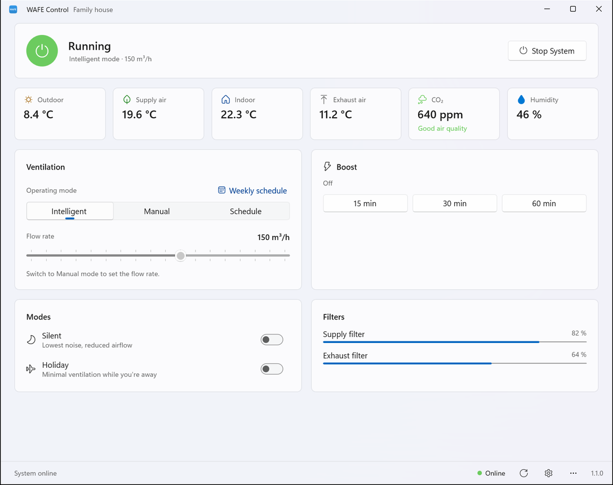
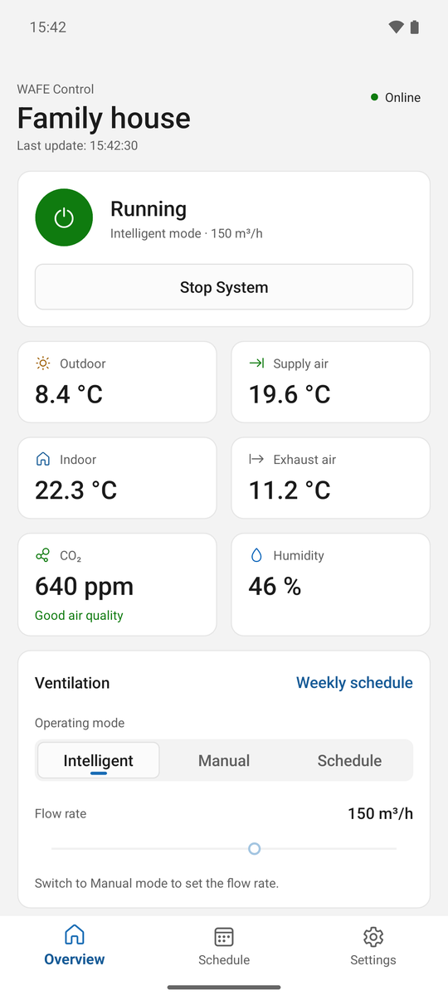

# WAFE Control

Unofficial apps for monitoring and controlling a Wafe heat-recovery ventilation unit through the go2my.wafe.eu cloud API. Not affiliated with WAFE s.r.o. (see [License](#license)). The unit's manual is on WAFE's site: [W0201 manual (Czech, PDF)](https://go2my.wafe.eu/resources/manual-w0201-cz.pdf).

Vibe coded with [Claude Code](https://claude.com/claude-code): the code, tests and docs were written by Claude from prompts, then reviewed and tested by hand.

[Latest release](#latest-release) · [Screenshots](#screenshots) · [Apps](#apps) · [Translations](#translations) · [Solution layout](#solution-layout) · [Tools](#tools) · [Build and run](#build-and-run) · [CI](#ci) · [Release](#release) · [Where data is stored](#where-data-is-stored) · [Wafe API](#wafe-api) · [Planned features](#planned-features) · [Open questions](#open-questions) · [License](#license)

## Latest release

| Platform | Version | Release build |
| --- | --- | --- |
| 🖥️ Windows 11 (x64, ARM64) | [v1.1.0](https://github.com/viliamb992/wafe-recuperation-app/releases/tag/v1.1.0) | [](https://github.com/viliamb992/wafe-recuperation-app/actions/workflows/release.yml) |
| 🤖 Android 8+ | [android-v1.1.0](https://github.com/viliamb992/wafe-recuperation-app/releases/tag/android-v1.1.0) | [](https://github.com/viliamb992/wafe-recuperation-app/actions/workflows/release-android.yml) |
| 🍎 iOS 15+ | – | Not released |

A release is **stable** when its tag has no suffix (`v1.1.0`, `android-v1.1.0`) and its release build passed. A suffix (`v1.2.0-beta.1`) publishes a pre-release. The badges show the result of each app's latest release build.

## Screenshots

| 🖥️ Windows 11 | 📱 Android |
| --- | --- |
|  |  |

More screens (schedule, settings, dark theme, tablet) are in [docs/SCREENSHOTS.md](docs/SCREENSHOTS.md).

## Apps

| Project | Platform | Status |
| --- | --- | --- |
| `WafeControl.WinUI` | Windows 11, native WinUI 3 | Main desktop app |
| `WafeControl.Mobile` | Android 8+ and iOS 15+, .NET MAUI | Dashboard, schedule and settings; Android is released for sideloading, iOS isn't |

Both apps follow one design manual, [docs/DESIGN.md](docs/DESIGN.md): colors, type, spacing, icons and components.

### 🖥️ Windows app features

- 🔐 **Sign in** with your Wafe account. "Keep me signed in" remembers the login, and the app signs in again automatically when the session expires.
- 📊 **Dashboard:** running state with Start/Stop, outdoor/supply/indoor/exhaust temperatures, CO₂ with air-quality hint, humidity (only on units with that sensor), operating mode (Intelligent / Manual / Schedule), flow rate (Manual mode), Boost 15/30/60 min, Silent and Holiday modes, filter health.
- 🎨 **Windows 11 look:** Mica, native title bar, light/dark theme (follows Windows or set in Settings), layout adapts to window width. The window reopens where you left it; the version is shown in the footer and in Settings → About.
- 📅 **Weekly schedule:** a Mon–Sun grid like the Wafe web app. Click or drag to add an action, click a block to edit or delete it (up to 50 actions).
- 🔔 **Tray:** closing the window keeps the app in the tray (in Efficiency Mode), or exits it if you choose that in Settings. Pointing at the tray icon shows whether the unit is running, its mode, air flow and CO₂. The tray menu offers boost shortcuts and Exit. Launching the app again brings the existing window back (single instance).
- 🚀 **Startup (optional):** start with Windows, and start hidden in the tray (the window still opens if you need to sign in).
- 🌐 **Languages:** Czech (default), Slovak and English. Switch in Settings (gear in the footer, also on the sign-in screen). The change applies right away and is kept for the next launch.

### 📱 Mobile app features

- 🔐 **Sign-in:** same sign-in, remembered login (Android Keystore / iOS Keychain) and languages as on Windows; language and appearance can be set before signing in (gear on the sign-in screen).
- 🧭 **Tabs:** Overview, Schedule, Settings. Pull down to refresh; banners for no internet and an offline unit; command results show as a short message at the bottom.
- 📊 **Overview:** unit name as the title, online state, running state with Start/Stop (stopping asks first), the sensor tiles, operating mode, flow slider (sends when you let go, with a haptic tick every 10 m³/h), Boost 15/30/60 min with a live countdown, Silent/Holiday switches, filter health.
- 📅 **Schedule:** one day at a time on a 24-hour timeline with a "now" line. Tap an empty time to add an action, tap an action to edit or delete it (same rules as the Windows grid).
- ⚙️ **Settings:** language, appearance (system/light/dark), the unit (rename, model, serial number, service contact), sign out, about.

## Translations

All app text lives in `src/WafeControl.Core/Localization`: `Strings.resx` (Czech, the primary language), `Strings.sk.resx` and `Strings.en.resx`. The build generates the typed `Strings` class from them, used by view models and in XAML as `{x:Bind loc:Strings.Key}`. Add a key to all three files; a test fails if a translation is missing or its `{0}` placeholders differ.

## Solution layout

```text
src/
  WafeControl.Shared/    API client, models (source-generated JSON), session + auth handler
  WafeControl.Core/      Services and view models (CommunityToolkit.Mvvm), shared by every app
  WafeControl.WinUI/     Windows app (WinUI 3, Windows App SDK, unpackaged)
  WafeControl.Mobile/    Android and iOS app (.NET MAUI)
  WafeControl.Tests/     Tests for Shared + Core (xUnit.net v3 on Microsoft.Testing.Platform)
```

## Tools

Needed to build:

- **.NET 10 SDK** (10.0.401 or later) with the **`maui-android` workload** (`dotnet workload install maui-android`). The solution includes the mobile app, so the workload is needed even for the Windows app.
- **Windows 11** for the WinUI app. The Windows App SDK (2.5) comes from NuGet and is bundled self-contained, so no runtime installer is needed.
- **Android SDK and OpenJDK 21** for the Android app (Visual Studio's Android workload installs both), plus an emulator or a phone with USB debugging.
- **Inno Setup 7** to build the Windows installer locally (`installer/WafeControl.iss`); the release workflow installs it itself.
- **A Mac with Xcode** for iOS builds.

Optional:

- **Visual Studio** (.NET MAUI and WinUI workloads) or **VS Code** with the C# Dev Kit.
- **Python 3 + fonttools** (`pip install fonttools`) to regenerate the mobile icon font with `tools/subset-icons.py`.
- **Claude Code**, which wrote the app.

Used by the project: **GitHub Actions** (Build CI on pull requests, releases from tags), **CommunityToolkit.Mvvm** (view models), **Windows App SDK / WinUI 3** with CommunityToolkit.WinUI Segmented and **H.NotifyIcon** (tray), **.NET MAUI**, **Microsoft.Extensions.Http.Resilience**, **Serilog** (logs), **xUnit.net v3** on Microsoft.Testing.Platform and **NSubstitute** (tests), **Fluent System Icons**.

## Build and run

The WinUI app builds on Windows only.

```powershell
dotnet build WafeControl.slnx
dotnet test --solution WafeControl.slnx
# Tests with code coverage (Cobertura XML in TestResults/)
dotnet test --project src/WafeControl.Tests --coverage --coverage-output-format cobertura --results-directory TestResults
dotnet run --project src/WafeControl.WinUI

# Android: running emulator or device (adb devices)
dotnet build src/WafeControl.Mobile -f net10.0-android -t:Run
# Release APK/AAB (full trimming + R8), signed with the debug key; see "Android signing" for your own key
dotnet publish src/WafeControl.Mobile -f net10.0-android -c Release
```

iOS is built only on a Mac (or from Visual Studio paired with one): the `net10.0-ios` target is on by default on macOS, and on Windows with `-p:EnableIosBuild=true`, which compiles but can't package or sign.

`global.json` puts `dotnet test` in Microsoft.Testing.Platform mode, so pass the solution with `--solution` (or a project with `--project`). Visual Studio's Test Explorer runs the tests directly.

## CI

`.github/workflows/build-ci.yml` runs on every pull request to `master` and only does what the change needs:

- 🧪 **Tests with coverage** when Shared, Core or the tests change. The coverage summary is posted as a pull request comment and in the run summary; the full HTML report is a run artifact.
- 🖥️ **Windows build** when the WinUI app changes; 🤖 **Android build** when the mobile app changes.
- Changes to Shared, Core, central package versions or SDK settings run everything. Docs-only changes run nothing.

Run it manually (Actions → Build CI → Run workflow) to build everything.

## Release

**Windows:** push a version tag (`git tag v1.2.0 && git push origin v1.2.0`). `.github/workflows/release.yml` tests, publishes the WinUI app for x64 and ARM64, builds an installer for each with Inno Setup (`installer/WafeControl.iss`) and attaches them to a GitHub Release. Tags with a suffix (`v1.2.0-beta.1`) become pre-releases.

**Android:** push an Android tag (`git tag android-v1.0.0 && git push origin android-v1.0.0`). `.github/workflows/release-android.yml` tests, builds a signed APK and attaches it to its own GitHub Release (never marked "latest", so the Windows release stays the latest one). The app is sideloaded, not in a store: open the release on the phone, download the APK and install it (Android asks once to allow installs from the browser). Later versions install over it and keep the login.

### Android signing

Updates only install over an APK signed with the same key, so create one key and keep it (plus its password) somewhere safe; losing it means uninstalling and signing in again. Once:

```powershell
# keytool comes with the JDK that Visual Studio installs for Android
& "C:\Program Files\Android\openjdk\jdk-21.0.8\bin\keytool.exe" -genkeypair -v `
  -keystore wafe-release.keystore -alias wafe -keyalg RSA -keysize 4096 -validity 10000 `
  -dname "CN=WAFE Control"
# Base64 for the GitHub secret (copied to the clipboard)
[Convert]::ToBase64String([IO.File]::ReadAllBytes("$PWD\wafe-release.keystore")) | Set-Clipboard
```

keytool asks for a password (used for both the store and the key). Keep the `.keystore` file out of the repository. In GitHub → Settings → Secrets and variables → Actions, add `ANDROID_KEYSTORE_BASE64` (the clipboard), `ANDROID_KEYSTORE_PASSWORD` and `ANDROID_KEY_PASSWORD` (the password), and `ANDROID_KEY_ALIAS` (`wafe`).

To build a signed APK locally instead (output in `publish/`):

```powershell
$env:WAFE_KEY_PASSWORD = Read-Host -MaskInput 'Keystore password'
dotnet publish src/WafeControl.Mobile -f net10.0-android -c Release -o publish -p:AndroidPackageFormats=apk `
  -p:AndroidKeyStore=true -p:AndroidSigningKeyStore="$PWD\wafe-release.keystore" -p:AndroidSigningKeyAlias=wafe `
  -p:AndroidSigningStorePass=env:WAFE_KEY_PASSWORD -p:AndroidSigningKeyPass=env:WAFE_KEY_PASSWORD
```

## Where data is stored

- **Remembered login:** `%AppData%\WafeControl\credentials.dat`, encrypted with Windows DPAPI for the current user. "Sign out" in the ⋯ menu deletes it.
- **Settings (WinUI app):** `%AppData%\WafeControl\settings.json` (language, theme, closing and startup behaviour, window position). Start with Windows is the `WafeControl` entry under `HKCU\Software\Microsoft\Windows\CurrentVersion\Run` (also listed in Task Manager → Startup apps).
- **Mobile app:** the remembered login is in the platform's secure storage (Android Keystore, iOS Keychain), language and theme in the app's preferences. App backup is off on Android, since a restored login couldn't be decrypted anyway.
- **Logs (WinUI app):** `%LocalAppData%\WafeControl\logs`, kept for 7 days. Open them via ⋯ → "Open log folder". Passwords are never logged.
- **Versions up to 1.0.1** used `RecuperationSystem` folders and a `WafeRecuperation` startup entry; the app moves them on its first start (`LegacyInstallMigration`), and setup removes the old files and shortcuts.

## Wafe API

Base URL `https://go2my.wafe.eu/api/`.

| Call | Purpose |
| --- | --- |
| `POST auth/context` `{"username", "password"}` | Sign in; returns 201 with a `Sandcastle-Key` header |
| `GET api/v1/main` | Status: temperatures, CO₂, flow, mode, boost, filters, … (kebab-case JSON) |
| `PUT api/v1/main/stop-active` | Start/stop the unit |
| `PUT api/v1/main/flow-requested` | Flow rate, 50–220 m³/h (Manual mode) |
| `PUT api/v1/main/authority` | Operating mode |
| `PUT api/v1/main/boost-remaining` | Boost duration in seconds (0 stops it) |
| `PUT api/v1/main/silent-active`, `holiday-active` | Silent / Holiday mode |
| `GET api/v1/schedule` | Weekly plan: `{"modes": ["min","auto","nom","boost"], "plan": "boost-0:2:0-0:3:0 …"}` |
| `PUT api/v1/schedule/plan` | Replaces the **whole** plan (always send every entry) |

Plan entries are `mode-D:H:M-D:H:M` with day 0 = Monday, e.g. `boost-6:2:0-6:2:30` = Sunday 02:00–02:30.

All PUT bodies are `{"value": …}`. Requests carry the `Sandcastle-Key` header; on 401/403 the app signs in again and retries once.

Request bodies must be sent with a `Content-Length`: the server answers chunked bodies with 500.

## Planned features

**🖥️ Windows**

- 🎛️ Hide controls the unit doesn't support (its `capabilities` list, e.g. `["boost","silent","holiday"]`).
- ⏱️ Boost countdown that ticks every second between polls.
- 🔔 Toast notifications: filter health low, unit offline, boost finished.
- ⚙️ Setting for the poll interval.
- ⬆️ Auto-updater from GitHub Releases: an "Update available" button in the title bar, a dialog with the new version and download size, then a silent run of the setup for the current architecture. Checks `releases/latest` on startup and every few hours. The installer needs a switch to relaunch the app after a silent install (its `[Run]` entry is `skipifsilent`).
- 📌 Jump list: Boost 15/30, Stop boost.
- 📅 Schedule: a "now" line, copy a day to other days (already in Core), and a keyboard way to add an action.
- 🔏 Code signing, so SmartScreen stops warning on first run (Azure Trusted Signing or a certificate).

**📱 Mobile**

- ⚡ App shortcuts: Boost 15/30, Stop boost.
- 🤖 Android: edge-to-edge, optional biometric unlock. iOS: haptics, optional Face ID.
- 🍎 iOS: first run on a Mac (page sheets, safe areas, tab icons, input borders), then an ad hoc `.ipa` from a macOS runner.
- ♿ Screen reader pass (TalkBack, VoiceOver), possibly with a list view of the day's actions.
- 🔔 Background notifications (Android `WorkManager`, iOS `BGAppRefreshTask`).
- 🧩 Android Quick Settings tile and home-screen widget.

**🔁 Both**

- ✉️ Messages screen, once a real `/messages` response has been captured (Debug log → test fixture → model).
- 📈 History chart for temperatures and CO₂. The API has no history, so the app would sample into SQLite.

## Open questions

- Is a Mac available for iOS builds, or should they go through CI only?
- How long does a `Sandcastle-Key` session live? Re-login on 401 covers it either way.
- Is there official Wafe API documentation, or are all models reverse-engineered?
- What do the `/header` fields `message` (always `null` so far) and `pm` mean?

## License

The code is licensed under the [MIT License](LICENSE).

**Not affiliated with WAFE.** WAFE is a trademark of WAFE s.r.o. This is an unofficial project: it is not made, endorsed or supported by WAFE s.r.o. The WAFE name and wordmark (app icon, sign-in screen) only identify the units the apps work with; they belong to WAFE s.r.o. and are not covered by the MIT License. The same goes for the unit manual, which is linked rather than included.

The apps use the undocumented go2my.wafe.eu API that the Wafe web app uses, so they can stop working whenever it changes. They send real commands to your unit (start/stop, modes, schedule); use them at your own risk.

Third-party: the mobile app's icon font is a subset of [Fluent System Icons](https://github.com/microsoft/fluentui-system-icons), MIT License, © Microsoft Corporation ([license](src/WafeControl.Mobile/Resources/Fonts/FluentIcons-LICENSE.txt)).
