# Screenshots

What WAFE Control 1.1.0 looks like today, on Windows 11 and Android (phone and tablet). The values come from a demo unit ("Family house"), not a real account.

Back to the [README](../README.md).

## 🖥️ Windows 11

| Dashboard | Dashboard, dark theme, boost running |
| --- | --- |
|  | 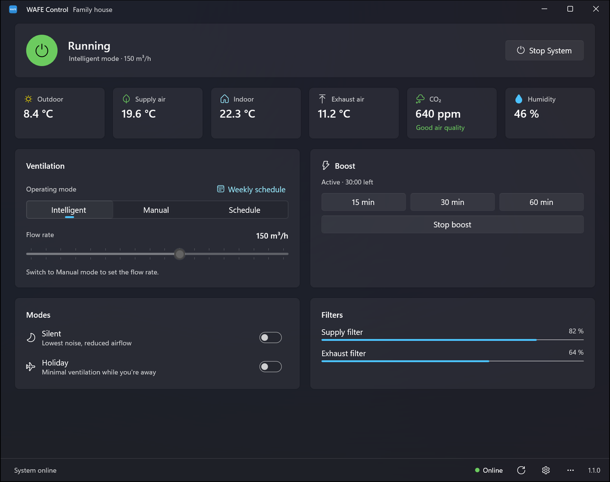 |

| Weekly schedule | Editing an action |
| --- | --- |
| 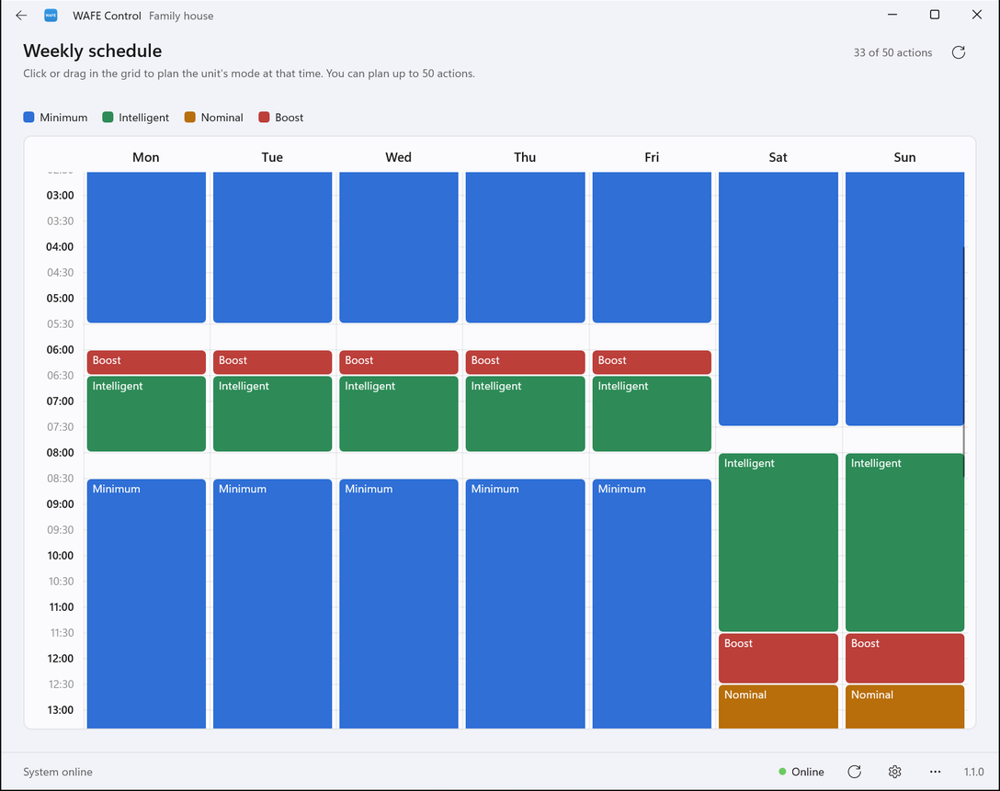 | 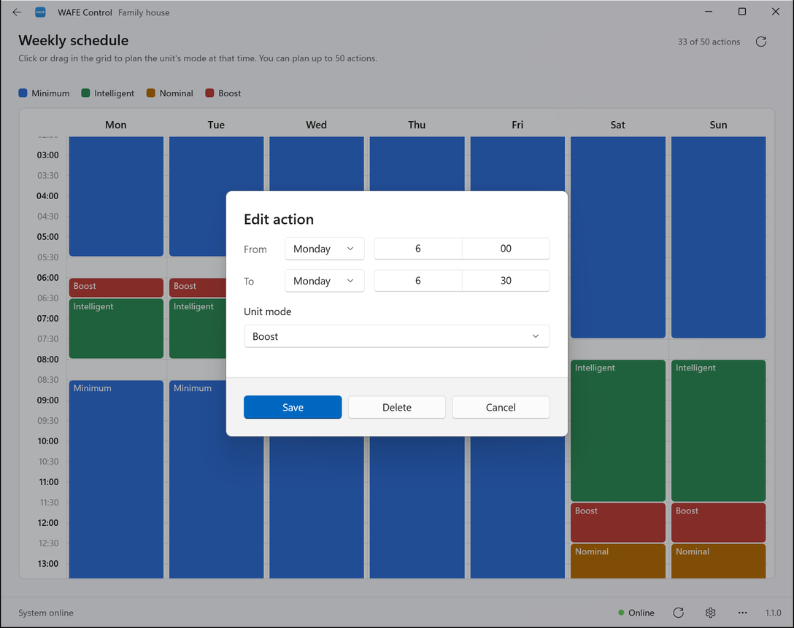 |

| Settings | Sign in |
| --- | --- |
| 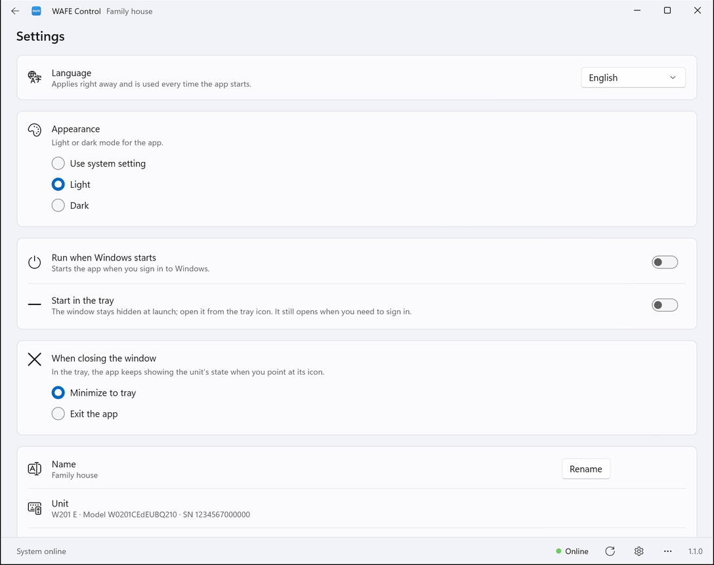 | 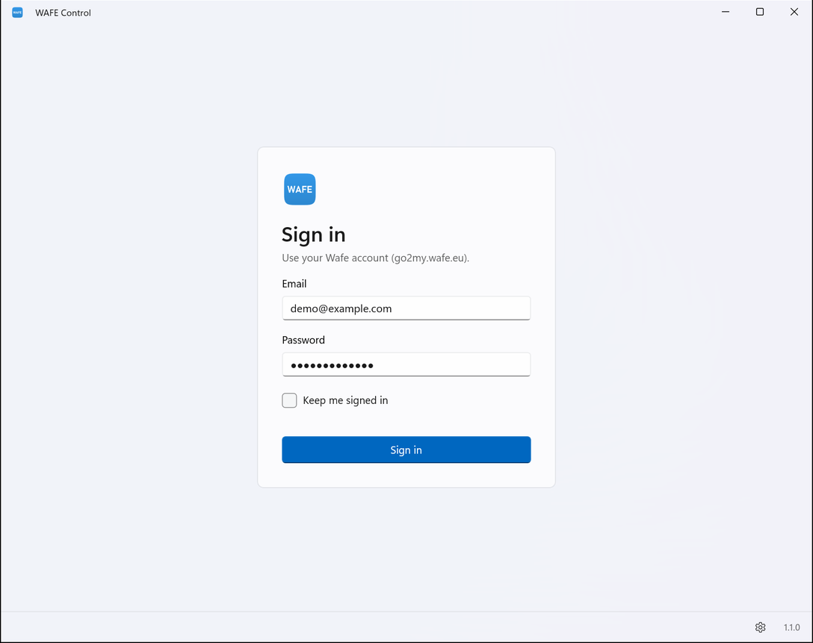 |

## 📱 Android phone

| Sign in | Overview | Controls, boost running |
| --- | --- | --- |
| 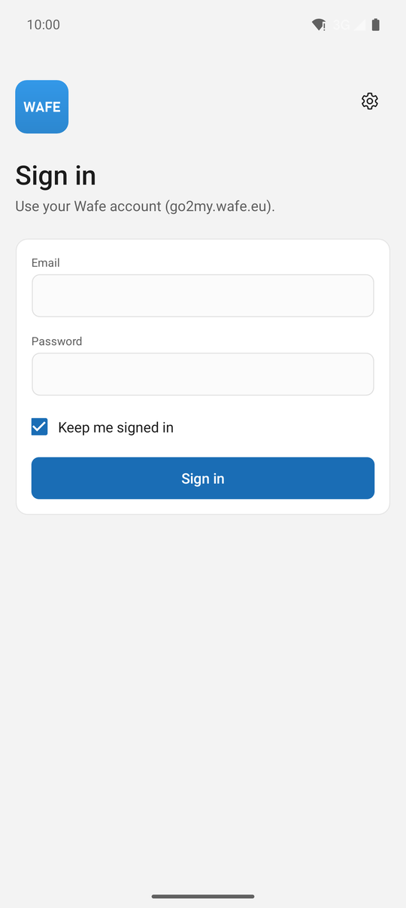 |  | 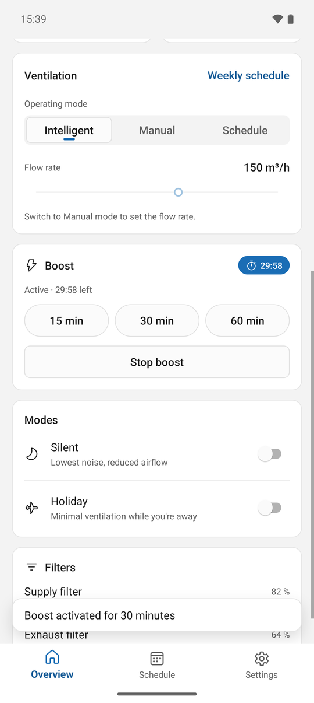 |

| Overview, dark theme | Schedule | Editing an action |
| --- | --- | --- |
| 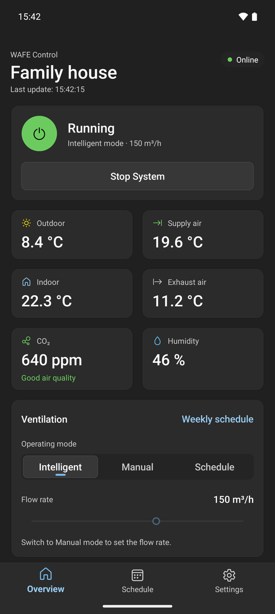 | 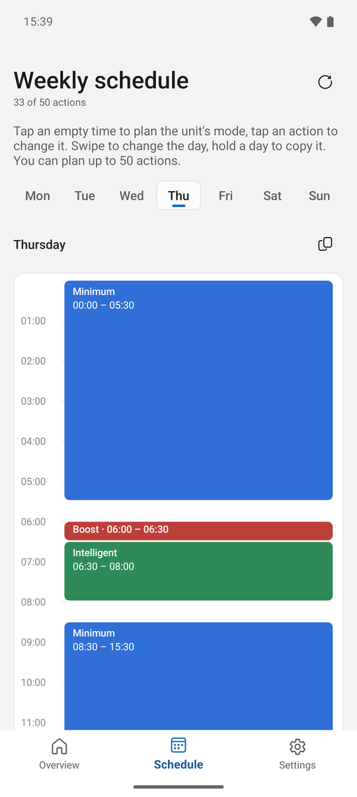 | 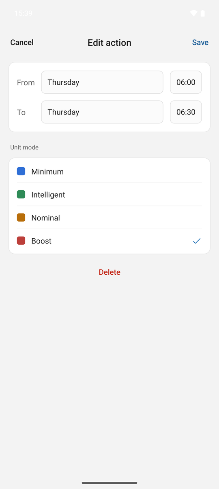 |

| Settings |
| --- |
| 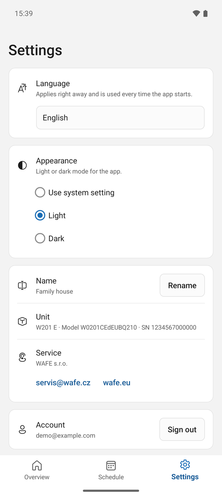 |

## 📱 Android tablet

From about 700 dp wide the overview switches to two columns.

| Overview, landscape |
| --- |
| 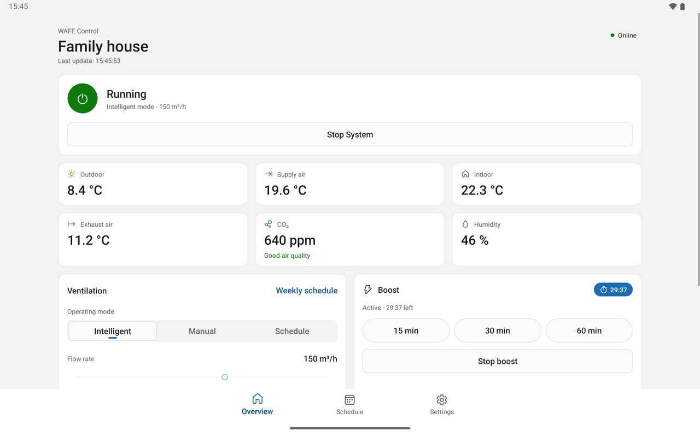 |

| Schedule, landscape |
| --- |
| 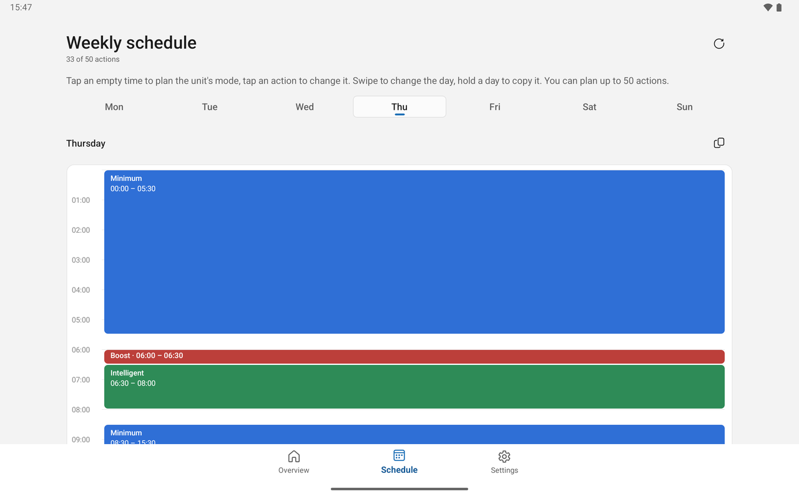 |

| Overview, portrait, dark theme |
| --- |
| 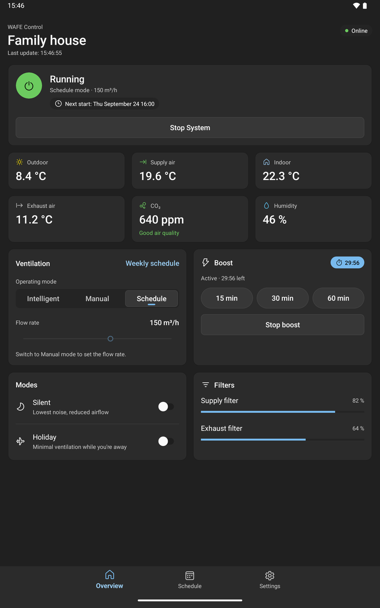 |
